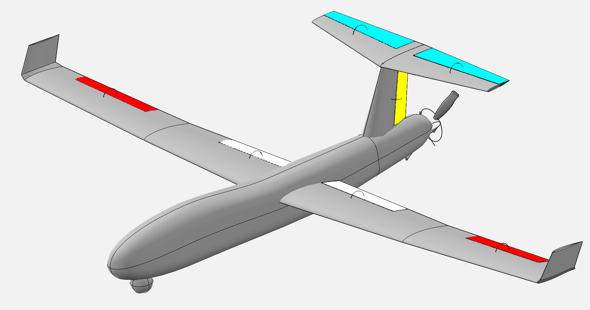
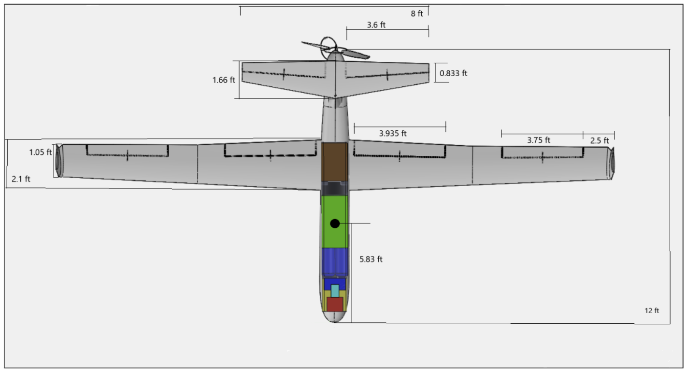
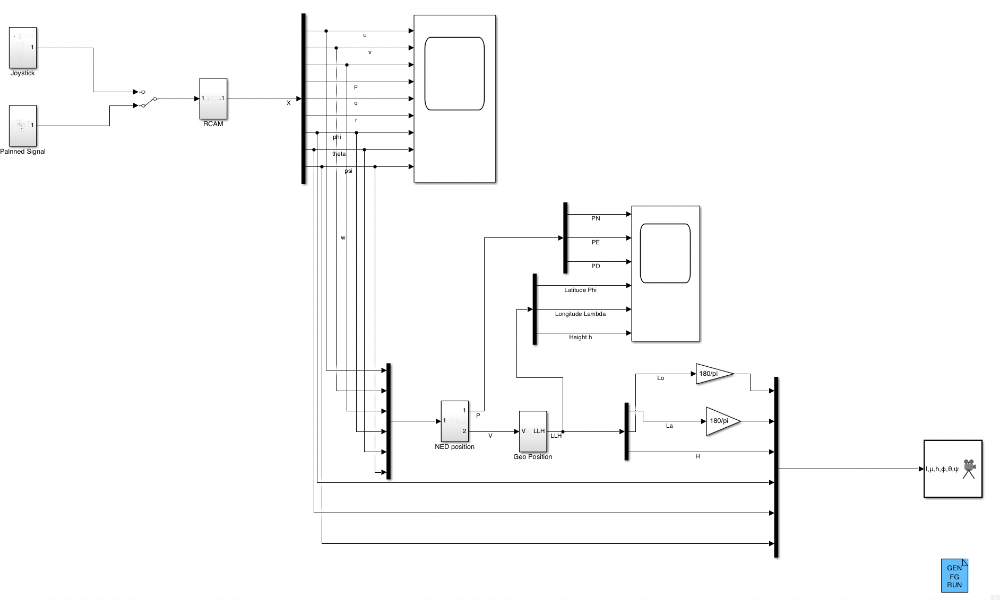
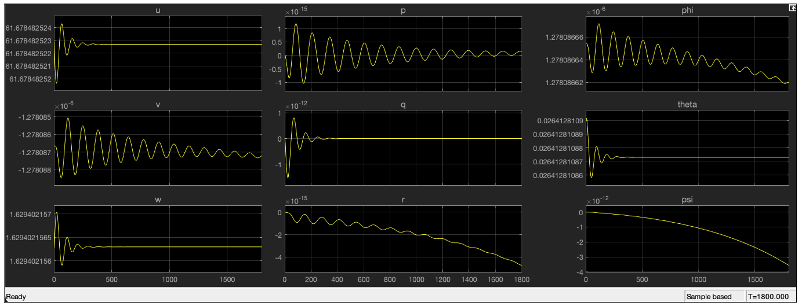
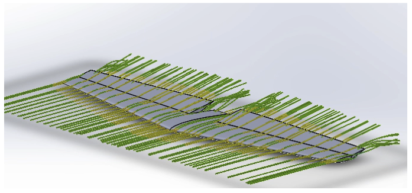
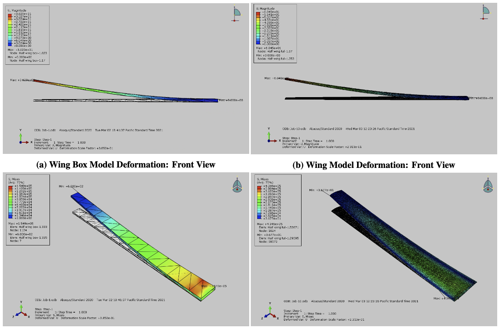
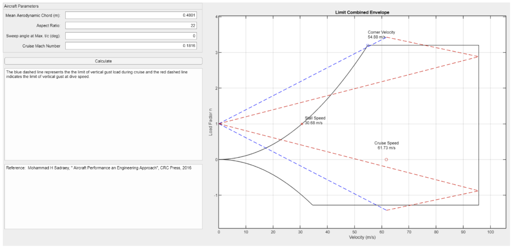

# Disaster Response UAV

>This repo archieves code and artifacts, along with writings,of a disaster-response UAV design project. I completed in 2020 with my esteemed colleagues at University of Washington William E. Boeing Department of Aeronautics and Astronautics.

## Full Reports

<!-- - [Portfolio summary](docs/summary.md) -->
- [Final report](docs/reports/final-report.pdf)
<!-- - [Request for proposal](docs/references/request-for-proposal.pdf) -->

## Project Context

The project goal was to develop a fixed-wing UAV concept for disaster response missions such as wildfire and hurricane support. The aircraft was intended to restore situational awareness and communications over large operating areas by carrying visual and thermal imaging payloads, atmospheric sensors, and a communications package.

The concept was designed around:

- 120-knot cruise performance
- 12+ hour endurance, with a reported maximum endurance of 13.5 hours
- STOL capability with takeoff and landing distances below 1000 ft
- Payload support for sensing, communications, and autonomous flight hardware

## Visual Overview

Primary concept render:

Aircraft Dimensions:

RCAM simulation in Simulink

Impulse Response Stability of Cruise

Fluid Dynamics of Elevators

Finite Element Analysis of Wings

Flight Performance Envelope

## Technical Artifacts

- `models/rcam/`: MATLAB and Simulink files for RCAM-based flight-dynamics modeling, trim, and linearization
- `models/openvsp/final/`: final OpenVSP-derived mass properties and force-coefficient exports
- `analysis/stability/`: hand-calculated stability analysis artifact
- `analysis/control_surfaces/`: control-surface sizing and hinge-moment scripts
- `docs/reports/`: the complete final report
